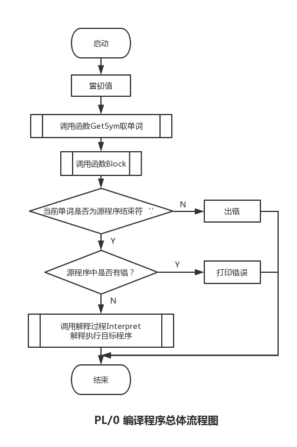
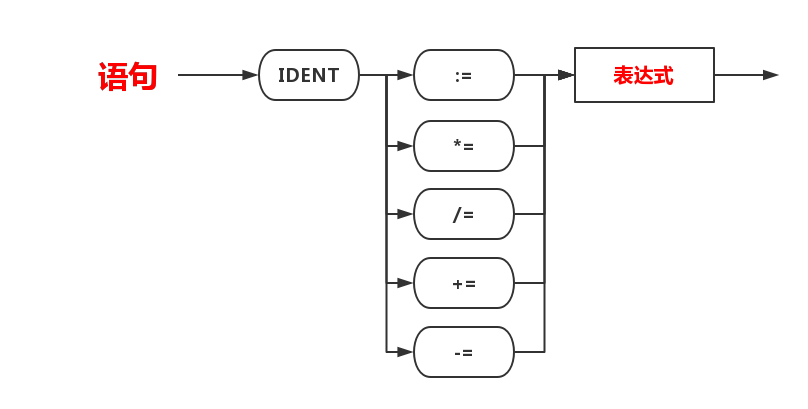
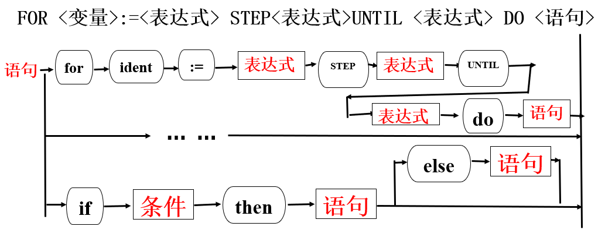
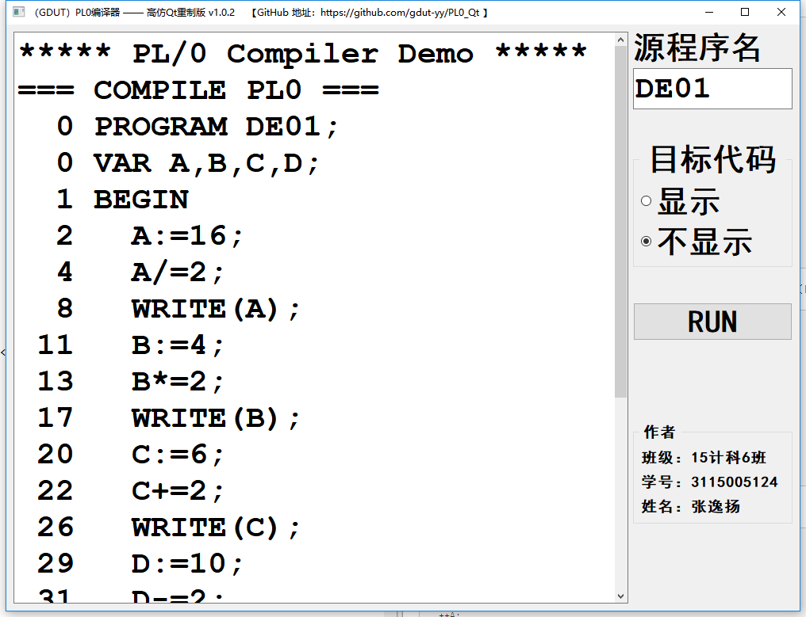
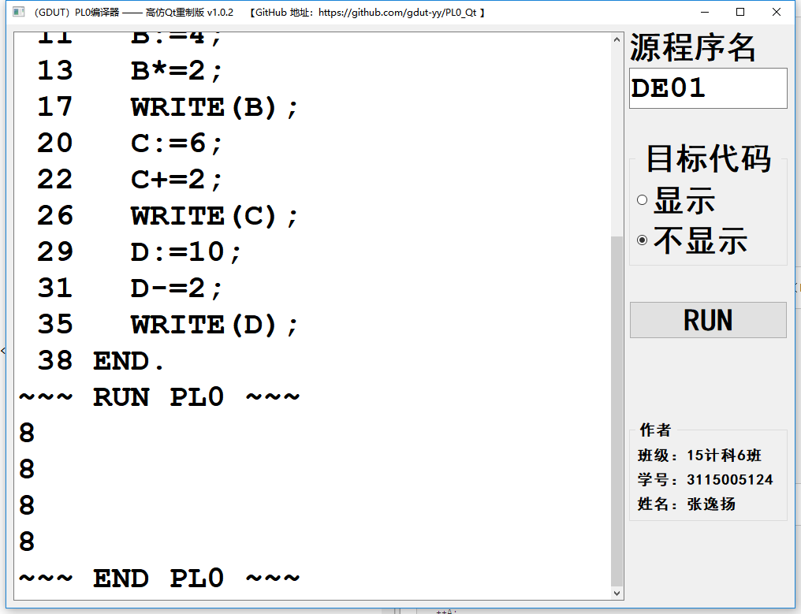
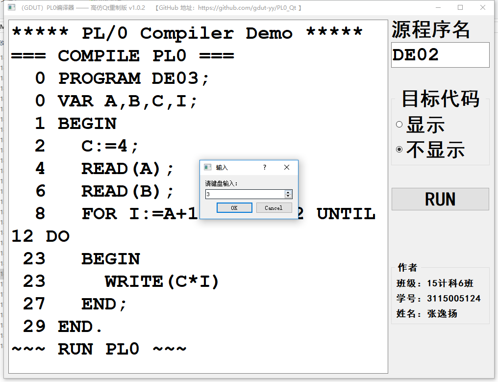
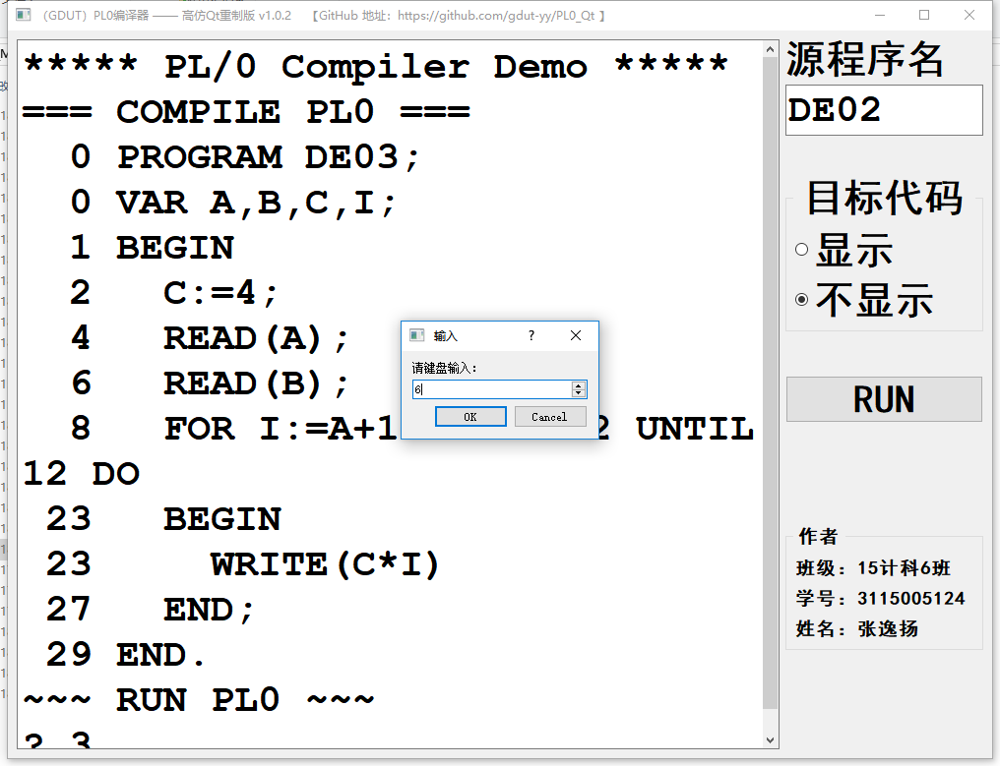
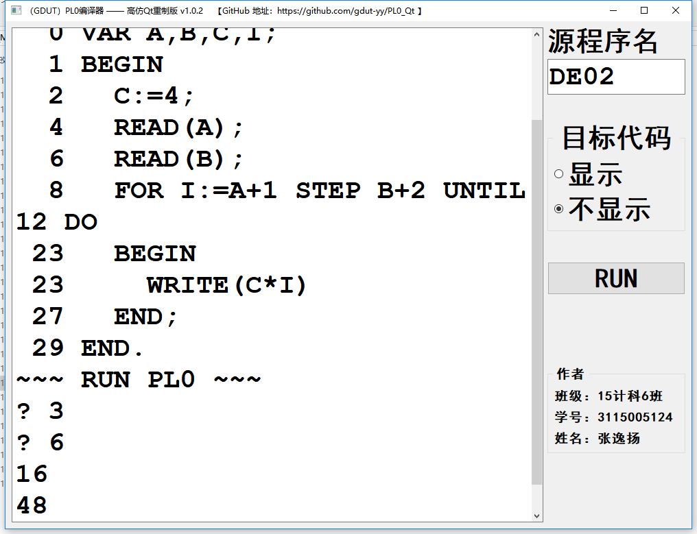
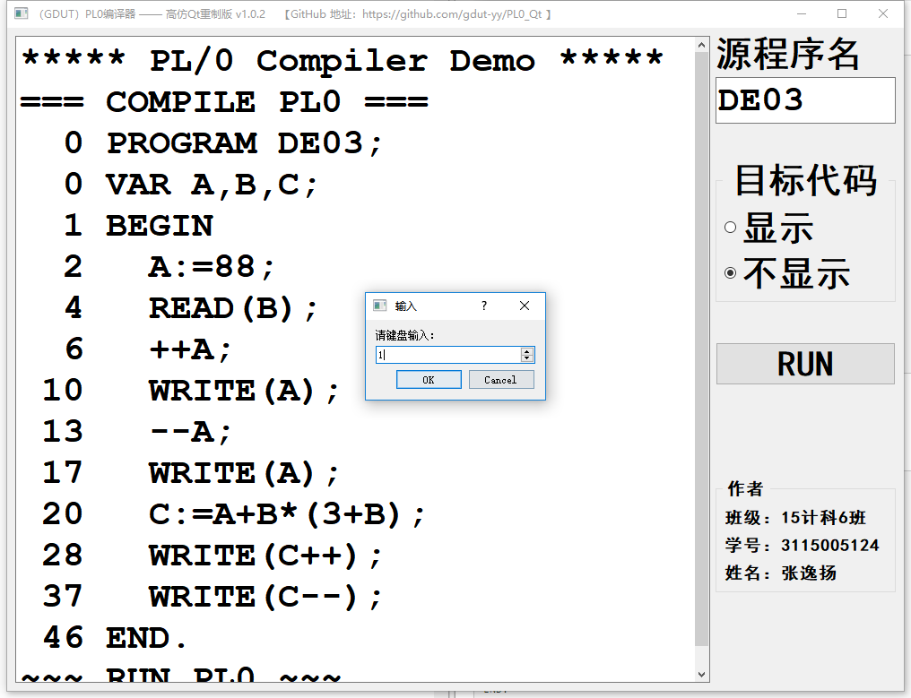
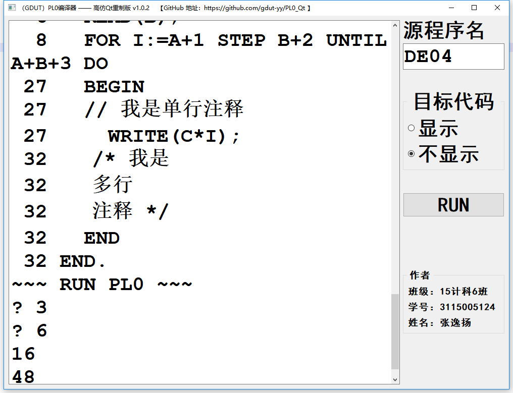

# PL/0 编译器的扩充--课程设计

## 一、实验目的与要求

	基本内容（成绩范围：“中”、“及格”或“不及格”）
	（1）扩充赋值运算：*= 和 /=
	（2）扩充语句（Pascal的FOR语句）:
	 FOR <变量>:=<表达式>STEP<表达式>UNTIL<表达式>Do<语句>
	
	选做内容（成绩评定范围扩大到：“优”和“良”）
	（1）增加类型：① 字符类型；  ② 实数类型。
	（2）扩充运算：++ 和 --（要求作为表达式实现） 
	（3）扩充函数：① 有返回值和返回语句；② 有参数函数。   
	（4）增加一维数组类型（可增加指令）。   
	（5）其他典型语言设施。

## 二、实验环境与工具 

	1、源语言：PL/0语言，PL/0语言是PASCAL语言的子集，它的编译程序是一个编译解析执行系统，后缀名为.PL0；
	2、目标语言：生成文件后缀为*.COD的目标代码 
	3、实现平台：Borland C++ Builder 6 
	4、运行平台：Windows 7 64位 

## 三、实现内容

	由于本程序在课内实验的基础上进行修改，所以本身具有课程实验要求的全部功能。全部功能具体如下：
	
	1. 增加了保留字 ELSE，FOR，STEP，UNTIL，RETURN； 运算符 *=，/=，&，||，！ ；
	2. 不等号 由 # 改为了 <> ；
	3. 增加了条件语句的ELSE子句 ；
	4. 扩充赋值运算：*= 和 /= ；
	5. 扩充语句。FOR <变量>:=<表达式>STEP<表达式>UNTIL<表达式>Do<语句> ；
	6. （选做）扩充运算符 +=，-= ；
	7. （选做）扩充运算：++ 和 -- ；
	8. （选做）多行注释功能 /**/ 实现 ；
	9. （选做）单行注释功能 // 实现 ；

## 四、结构设计说明

### a) PL/0编译程序的结构图 

PL/0语言可看成是PASCAL语言的子集，它的编译程序是一个编译解释执行系统。PL/0的目标程序为假想栈式计算机的汇编语言，与具体计算机无关。

### b) PL/0编译程序的过程或函数的功能表

| 过程或函数名 | 简要功能 |
| - | - |
| Error(int n) | 出错处理，打印出错位置和错误编码 |
| GetCh() | 漏掉空格，读取一个字符 |
| GetSym() | 词法分析， 读取一个单词 |
| GEN(FCT X, int Y, int Z) | 生成目标代码，并送入目标程序区 |
| TEST(SYMSET S1, SYMSET S2, int N) | 测试当前单词符号是否合法 |
| Enter(OBJECTS K, int LEV, int &TX, int &DX) | 登录名字表 |
| Position(ALFA ID, int TX) | 查找标识符在名字表中的位置 |
| ConstDeclaration(int LEV,int &TX,int &DX) | 常量定义处理 |
| VarDeclaration(int LEV,int &TX,int &DX) | 变量说明处理 |
| ListCode(int CX0) | 列出目标代码清单 |
| FACTOR(SYMSET FSYS, int LEV, int &TX) | 因子处理 |
| TERM(SYMSET FSYS, int LEV, int &TX) | 项处理 |
| EXPRESSION(SYMSET FSYS, int LEV, int &TX) | 表达式处理 |
| CONDITION(SYMSET FSYS, int LEV, int &TX) | 条件处理 |
| STATEMENT(SYMSET FSYS, int LEV, int &TX) | 语句处理 |
| Block(int LEV, int TX, SYMSET FSYS) | 分程序分析处理过程 |
| BASE(int L,int B,int S[]) | 通过静态链求出数据区的基地址 |
| Interpret() | 对目标代码的解析执行程序 |

### c) PL/0编译程序的总体流程图

## 五、主要成分描述

### 1、指令表
PL/0 编译程序所产生的目标代码是一个假想栈式计算机的汇编语言，称之为 PCODE 指令代码，它不依赖任何实际计算机，其指令集很简单，指令格式如下：

其中 f 代表功能码，l 表示层次差，也就是变量或过程被引用的分程序与说明该变量或过程的分程序之间的层次差。a 的含义对不同的指令有所区别，对存取指令表示位移量，而对其他的指令则分别有不同的含义，具体如下表：

| 指令 | 说明 |
|:-:| - |
| CAL L A | 调用地址为 A 的过程（置指令地址寄存器为A）；L 为调用过程与被调用过程的层差；设置被调用过程的3 个联系单元 |
| INT 0 A | 在栈顶开辟 A 个存储单元，服务于被调用的过程;A 等于该过程的局部变量数加 3;3 个特殊的联系单元 |
| JMP 0 A | 无条件转移至地址 A，即置指令地址寄存器为A |
| JPC 0 A | 条件转移指令；若栈顶为 0，则转移至地址 A，即置指令地址寄存器为A ；T 减1 |
| LIT 0 A | 立即数存入栈顶，即置T 所指存储单元的值为Al； T 加 1 |
| LOD L A | 将层差为L、偏移量为A的存储单元的值取到栈顶； T 加 1 |
| OPR 0 0 | 过程调用结束后,返回调用点并退栈； 重置基址寄存器和栈顶寄存器 |
| OPR 0 1 | 求栈顶元素的相反数，结果值留在栈顶 |
| OPR 0 2 | 次栈顶与栈顶的值相加，结果存入次栈顶； T 减 1 |
| OPR 0 3 | 次栈顶的值减去栈顶的值，结果存入次栈顶； T 减 1 |
| OPR 0 4 | 次栈顶的值乘以栈顶的值，结果存入次栈顶； T 减 1 |
| OPR 0 5 | 次栈顶的值除以栈顶的值，结果存入次栈顶； T 减 1 |
| OPR 0 6 | 栈顶元素的奇偶判断，若为奇数，结果为1；若为偶数，结果为0 ；结果值留在栈顶 |
| OPR 0 8 | 比较次栈顶与栈顶是否相等；若相等，结果为0；存结果至次栈顶；T 减1 |
| OPR 0 9 | 比较次栈顶与栈顶是否不相等；若不相等，结果为0；存结果至次栈顶；T 减1 |
| OPR 0 10 | 比较次栈顶是否小于栈顶； 若小于，结果为0；存结果至次栈顶；T 减1 |
| OPR 0 11 | 比较次栈顶是否大于等于栈顶； 若大于等于，结果为0；存结果至次栈顶；T 减1 |
| OPR 0 12 | 比较次栈顶是否大于栈顶； 若大于，结果为0；存结果至次栈顶；T 减1 |
| OPR 0 13 | 比较次栈顶是否小于等于栈顶； 若小于等于，结果为0；存结果至次栈顶；T 减1 |
| OPR 0 14 | 栈顶的值输出至控制台屏幕； T  减 1 |
| OPR 0 15 | 控制台屏幕输出一个换行 |
| OPR 0 16 | 从控制台读入一行输入，置入栈顶； T 加 1 |
| STO L A | T 减 1； 将栈顶的值存入层差为L、偏移量为A的存储单元 |

### 2、PL/0 出错信息表

| 出错编号 | 出错原因 |
|:-:| - |
| 1 | 常数说明中的 “=” 写成 “：=” |
| 2 | 常数说明中的 “=” 后应是数字 |
| 3 | 常数说明中的标识符后应是 “=” |
| 4 | const，var，procedure 后应是标识符 |
| 5 | 漏掉了 “.” 或 “;” |
| 6 | 过程说明后的符号不正确（应是语句开始符或过程定义符） |
| 7 | 应是语句开始符 |
| 8 | 程序体内语句部分的后跟符不正确 |
| 9 | 程序结尾丢了句号 “.” |
| 10 | 语句之间漏了 “;” |
| 11 | 标识符未说明 |
| 12 | 赋值语句中，赋值号左部标识符属性应是变量 |
| 13 | 赋值语句左部标识符应是赋值号 “:=” |
| 14 | call 后应为标识符 |
| 15 | call 后标识符属性应为过程 |
| 16 | 条件语句中丢了 “then” |
| 17 | 丢了 “end” 或 “;” |
| 18 | while 型循环语句中丢了 “do” |
| 19 | 语句后的符号不正确 |
| 20 | 应为关系运算符 |
| 21 | 表达式内标识符属性不能是过程 |
| 22 | 表达式中漏掉右括号 “)” |
| 23 | 因子后的非法符号 |
| 24 | 表达式的开始符不能是此符号 |
| 31 | 数越界 |
| 32 | read 语句括号中的标识符不是变量 |

## 3、PL/0 语言的文法规则

PL/0 文法描述的元语言（EBNF）符号说明

其中用到的 EBNF 元符号含义如下：

- <> ：用尖括号括起来的中文字表示语法构造成分，或称语法单元；而用尖括号括起来的英文字表示一类词法单元。
- ::= ：表示左部的语法单位由右部定义，可读作“定义为”。
- | ：表示“或”，即多选项。
- {} ：用花括号括起来的成分可以重复0次到任意多次。
- [] ：用方括号括起来的成分为任选项，即出现一次或不出现。

		<程序> ::= <分程序>
		<分程序> ::= [<常量说明部分>;][<变量说明部分>;]
		            {<过程说明部分>;}<语句部分>
		<常量说明部分> ::= const<常量定义>{,<常量定义>}
		<常量定义> ::= <标识符>=<无符号整数>
		<无符号整数> ::= <数字>{<数字>} 
		<变量说明部分> ::= var<标识符 >{,<标识符>} 
		<标识符> ::= <字母>{<字母>|<数字>} 
		<过程说明部分> ::= <过程首部><分程序>
		<过程首部> ::= procedure<标识符>
		<语句部分> ::= <语句>|<复合语句>
		<复合语句> ::= BEGIN<语句>{;<语句>}END
		<语句> ::= <赋值语句>|<条件语句>|<当型循环语句>|<过程调用语句>|
		          <读语句>|<写语句>|<复合语句>|<空语句>
		<赋值语句> ::= <标识符>:=<表达式>
		<条件> ::= <表达式><关系运算符><表达式>|ODD<表达式> 
		<表达式> ::= [+|-]<项>{<表达式><加法运算符><项>}
		<项> ::= <因子>|<项><乘法运算符><因子>
		<因子> ::= <标识符>|<常量>|(<表达式>)
		<常量> ::= <无符号整数>
		<加法运算符> ::= + | -
		<乘法运算符> ::= * | /
		<关系运算符> ::= <|>|<|>=|<=|=
		<条件语句> ::= if<条件>then<语句>
		<过程调用语句> ::= call<标识符>
		<当型循环语句> ::= while<条件>do<语句>
		<读语句> ::= read(<标识符>{,<标识符>})
		<写语句> ::= write(<表达式>{,<表达式>})
		<字母> ::= a|b|c···|z
		<数字> ::= 0|1|2···|9

## 六、开发过程和完成情况

### 1、参照已有的保留字，进行相应的命名和添加规范，再将 '+=' '-=' 保留字添加对应的保留字的集合中。

| 运算符 | += | -= | ++ | -- |
| - | - | - | - | - |
| SYM表示 | PLUSBECOMES | MINUSBECOMES | INCSYM | DECSYM |

修改后：

	const int SYMNUM = 47;  // SYM个数
	
	typedef enum  { NUL, IDENT, NUMBER, PLUS, MINUS, TIMES,
	                SLASH, ODDSYM, EQL, NEQ, LSS, LEQ, GTR, GEQ,
	                LPAREN, RPAREN, COMMA, SEMICOLON, PERIOD,
	                BECOMES, BEGINSYM, ENDSYM, IFSYM, THENSYM,
	                WHILESYM, WRITESYM, READSYM, DOSYM, CALLSYM,
	                CONSTSYM, VARSYM, PROCSYM, PROGSYM
	
	                // ↓↓↓ 新增部分 ↓↓↓
	                , ELSESYM, FORSYM, STEPSYM, UNTILSYM, RETURNSYM,	// 共5个。ELSE，FOR，STEP，UNTIL，RETURN
	                TIMESBECOMES, SLASHBECOMES, ANDSYM, ORSYM, NOTSYM	// 共5个。*=，/=，&，||，！
	                , PLUSBECOMES, MINUSBECOMES, INCSYM, DECSYM         // 共4个。+=，-+，++，--
	                // ↑↑↑ 新增部分 ↑↑↑
	
	        } SYMBOL;
	char *SYMOUT[] = {"NUL", "IDENT", "NUMBER", "PLUS", "MINUS", "TIMES",
	        "SLASH", "ODDSYM", "EQL", "NEQ", "LSS", "LEQ", "GTR", "GEQ",
	        "LPAREN", "RPAREN", "COMMA", "SEMICOLON", "PERIOD",
	        "BECOMES", "BEGINSYM", "ENDSYM", "IFSYM", "THENSYM",
	        "WHILESYM", "WRITESYM", "READSYM", "DOSYM", "CALLSYM",
	        "CONSTSYM", "VARSYM", "PROCSYM", "PROGSYM"
	
	        // ↓↓↓ 新增部分 ↓↓↓
	        , "ELSESYM", "FORSYM", "STEPSYM", "UNTILSYM", "RETURNSYM",	// 共5个。ELSE，FOR，STEP，UNTIL，RETURN
	        "TIMESBECOMES", "SLASHBECOMES", "ANDSYM", "ORSYM", "NOTSYM"	// 共5个。*=，/=，&，||，！
	        , "PLUSBECOMES", "MINUSBECOMES", "INCSYM", "DECSYM"         // 共4个。+=，-+，++，--
	        // ↑↑↑ 新增部分 ↑↑↑
	
	                 };

### 2、修改 void GetSym() 函数，添加 '*=' '/=' '+=' '-=' '&' '||' '!' '//' '/\*\*/' 运算符识别

	void GetSym() {
	  int i,J,K;   ALFA  A;
	  while (CH<=' ') GetCh();
	  if (CH>='A' && CH<='Z') { /*ID OR RESERVED WORD*/
	    K=0;
	    do {
	      if (K<AL) A[K++]=CH;
	      GetCh();
	    }while((CH>='A' && CH<='Z')||(CH>='0' && CH<='9'));
	    A[K]='\0';
	    strcpy(ID,A); i=1; J=NORW;
	    do {
	      K=(i+J) / 2;
	      if (strcmp(ID,KWORD[K])<=0) J=K-1;
	      if (strcmp(ID,KWORD[K])>=0) i=K+1;
	    }while(i<=J);
	    if (i-1 > J) SYM=WSYM[K];
	    else SYM=IDENT;
	  }
	  else
	    if (CH>='0' && CH<='9') { /*NUMBER*/
	      K=0; NUM=0; SYM=NUMBER;
	      do {
	        NUM=10*NUM+(CH-'0');
	        K++; GetCh();
	      }while(CH>='0' && CH<='9');
	      if (K>NMAX) Error(30);
	    }
	    else
	      if (CH==':') {
	        GetCh();
	        if (CH=='=') { SYM=BECOMES; GetCh(); }
	        else SYM=NUL;
	      }
	      else /* THE FOLLOWING TWO CHECK WERE ADDED
	             BECAUSE ASCII DOES NOT HAVE A SINGLE CHARACTER FOR <= OR >= */
	        if (CH=='<') {
	          GetCh();
	          if (CH=='=') { SYM=LEQ; GetCh(); }
	
	            // ↓↓↓ 新增部分 ↓↓↓
	            else if(CH=='>') { SYM=NEQ; GetCh(); }	// 不等号运算符 <>
	            // ↑↑↑ 新增部分 ↑↑↑
	
	          else SYM=LSS;
	        }
	        else
	          if (CH=='>') {
	            GetCh();
	            if (CH=='=') { SYM=GEQ; GetCh(); }
	            else SYM=GTR;
	          }
	
	    // ↓↓↓ 新增部分 ↓↓↓
	    else if(CH=='*') {		
	        GetCh();
	        if(CH=='=') {           // 运算符 '*='
	            SYM=TIMESBECOMES; GetCh(); 
	        }
	        else SYM=TIMES;
	    } else if(CH=='/') {	
	        GetCh();
	        if(CH=='=') {           // 运算符 '/='
	            SYM=SLASHBECOMES; GetCh(); 
	        }
	        else if(CH=='*'){       // '/* */' 多行注释
	            GetCh();
	            i=CH;
	            while (i!='*' || CH!='/') {
	                i=CH;
	                GetCh();
	            }
	            if(i!='*' && CH!='/') Error(19);
	            else{
	                GetCh();
	                GetSym();
	            }
	        }
	        else if(CH=='/'){       // '//' 单行注释
	            i=CX;
	            while (CC!=LL) {
	                GetCh();
	            }
	            GetSym();
	        }
	        else SYM=SLASH;
	    } else if(CH=='+') {    
	        GetCh();
	        if(CH=='=') {           // 运算符 '+='
	            SYM=PLUSBECOMES; GetCh(); 
	        }
	        else if(CH=='+') {      // 运算符 '++'
	            SYM=INCSYM; GetCh();
	        }
	        else SYM=PLUS;
	    } else if(CH=='-') {
	        GetCh();
	        if(CH=='=') {           // 运算符 '-='
	            SYM=MINUSBECOMES; GetCh(); 
	        }
	        else if(CH=='-') {      // 运算符 '--'
	            SYM=DECSYM; GetCh();
	        }
	        else SYM=MINUS;
	    } else if(CH=='&') {        // 运算符 '&'
	        GetCh();
	        SYM=ANDSYM;
	    } else if(CH=='|') {	
	        GetCh();
	        if(CH=='|') {           // 运算符 '||'
	            SYM=ORSYM; GetCh(); 
	        }
	        else Error(19);
	    } else if(CH=='!') {        // 运算符 '!'
	        GetCh();
	        SYM=NOTSYM;
	    }
	    // ↑↑↑ 新增部分 ↑↑↑
	
	          else { SYM=SSYM[CH]; GetCh(); }
	} /*GetSym()*/

### 3、添加 '*=' '/=' '+=' '-=' 逻辑运算

修改前：（原 Unit1.cpp 文件 line 385 ~ line 397）

	case IDENT:
	        i=POSITION(ID,TX);
	        if (i==0) Error(11);
	        else
	          if (TABLE[i].KIND!=VARIABLE) { /*ASSIGNMENT TO NON-VARIABLE*/
	            Error(12); i=0;
	          }
	        GetSym();
	        if (SYM==BECOMES) GetSym();
	        else Error(13);
	        EXPRESSION(FSYS,LEV,TX);
	        if (i!=0) GEN(STO,LEV-TABLE[i].vp.LEVEL,TABLE[i].vp.ADR);
	        break;

修改后：

    case IDENT:
        i=POSITION(ID,TX);
        if (i==0) Error(11);
        else
          if (TABLE[i].KIND!=VARIABLE) { /*ASSIGNMENT TO NON-VARIABLE*/
            Error(12); i=0;
          }
        GetSym();
        // if (SYM==BECOMES) GetSym();
        // else Error(13);
        // EXPRESSION(FSYS,LEV,TX);
        // if (i!=0) GEN(STO,LEV-TABLE[i].vp.LEVEL,TABLE[i].vp.ADR);

        // ↓↓↓ 新增部分 ↓↓↓
        if (SYM==BECOMES) {
            GetSym();
            EXPRESSION(FSYS,LEV,TX);
            if (i!=0) GEN(STO,LEV-TABLE[i].vp.LEVEL,TABLE[i].vp.ADR);
        }
        else if(SYM==TIMESBECOMES) {    // *= 逻辑运算
            GEN(LOD,LEV-TABLE[i].vp.LEVEL,TABLE[i].vp.ADR);
            GetSym();
            EXPRESSION(FSYS,LEV,TX);
            GEN(OPR,0,4);
            if (i!=0) GEN(STO,LEV-TABLE[i].vp.LEVEL,TABLE[i].vp.ADR);
        }
        else if(SYM==SLASHBECOMES) {    // /= 逻辑运算
            GEN(LOD,LEV-TABLE[i].vp.LEVEL,TABLE[i].vp.ADR);
            GetSym();
            EXPRESSION(FSYS,LEV,TX);
            GEN(OPR,0,5);
            if (i!=0) GEN(STO,LEV-TABLE[i].vp.LEVEL,TABLE[i].vp.ADR);
        }
        else if(SYM==PLUSBECOMES) {    // += 逻辑运算
            GEN(LOD,LEV-TABLE[i].vp.LEVEL,TABLE[i].vp.ADR);
            GetSym();
            EXPRESSION(FSYS,LEV,TX);
            GEN(OPR,0,2);
            if (i!=0) GEN(STO,LEV-TABLE[i].vp.LEVEL,TABLE[i].vp.ADR);
        }
        else if(SYM==MINUSBECOMES) {    // -= 逻辑运算
            GEN(LOD,LEV-TABLE[i].vp.LEVEL,TABLE[i].vp.ADR);
            GetSym();
            EXPRESSION(FSYS,LEV,TX);
            GEN(OPR,0,3);
            if (i!=0) GEN(STO,LEV-TABLE[i].vp.LEVEL,TABLE[i].vp.ADR);
        }
        else Error(13);
        // ↑↑↑ 新增部分 ↑↑↑

        break;

### 4、源代码中有一个bug，有可能是故意留的（Unit1.cpp 文件中 line 555）

	case 5: T--; S[T]=S[T] % S[T+1]; break;

应为：

	case 5: T--; S[T]=S[T]/S[T+1]; break;

### 5、 扩充语句。FOR <变量>:=<表达式>STEP<表达式>UNTIL<表达式>Do<语句> ；

先删去实验部分的 “新增部分”， 然后增加 case FORSYM:

	// ↓↓↓ 新增部分 ↓↓↓
    // 扩充语句。FOR <变量>:=<表达式>STEP<表达式>UNTIL<表达式>Do<语句> ；
    case FORSYM:
        GetSym();
        if(SYM!=IDENT) Error(47);
        else i=POSITION(ID,TX);
        if(i==0) Error(11);
        else if(TABLE[i].KIND!=VARIABLE){
            Error(12); i=0;
        }
        GetSym();
        if(SYM=BECOMES) GetSym();
        else Error(13);
        
        EXPRESSION(SymSetUnion(SymSetNew(STEPSYM),FSYS),LEV,TX);
        if(i!=0) GEN(STO,LEV-TABLE[i].vp.LEVEL,TABLE[i].vp.ADR);
        if(SYM==STEPSYM) GetSym();
        else Error(46);
        CX1=CX;
        GEN(JMP,0,0);
        CX3=CX;
        
        EXPRESSION(SymSetUnion(SymSetNew(UNTILSYM),FSYS),LEV,TX);
        GEN(LOD,LEV-TABLE[i].vp.LEVEL,TABLE[i].vp.ADR);
        GEN(OPR,0,2);
        GEN(STO,LEV-TABLE[i].vp.LEVEL,TABLE[i].vp.ADR);
        if(SYM==UNTILSYM) GetSym();
        else Error(47);
        CODE[CX1].A=CX;
        
        EXPRESSION(SymSetUnion(SymSetNew(DOSYM),FSYS),LEV,TX);
        GEN(LOD,LEV-TABLE[i].vp.LEVEL,TABLE[i].vp.ADR);
        GEN(OPR,0,11);
        CX2=CX;
        GEN(JPC,0,0);
        if(SYM==DOSYM) GetSym();
        else Error(48);
        
        STATEMENT(FSYS,LEV,TX);
        GEN(JMP,0,CX3);
        CODE[CX2].A=CX;
        break;

### 6、（选做部分）++、-- 的实现

自增、自减运算符 ++ 和 -- 的实现较为复杂，具体分为两种，i++、 i-- 或者 ++i、--i 。

#### 6.1、 i++、i-- 的实现

首先，对 void STATEMENT(SYMSET FSYS,int LEV,int &TX) 函数进行如下修改：

	case IDENT:
	        …………
	        else if(SYM==INCSYM) {          // i++ 逻辑运算
	            if(i!=0)
	                GEN(LOD,LEV-TABLE[i].vp.LEVEL,TABLE[i].vp.ADR);
	            GEN(LIT,0,1);
	            GEN(OPR,0,2);
	            if(i!=0)
	                GEN(STO,LEV-TABLE[i].vp.LEVEL,TABLE[i].vp.ADR);
	            GetSym();
	        }
	        else if(SYM==DECSYM) {          // i-- 逻辑运算
	            if(i!=0)
	                GEN(LOD,LEV-TABLE[i].vp.LEVEL,TABLE[i].vp.ADR);
	            GEN(LIT,0,1);
	            GEN(OPR,0,3);
	            if(i!=0)
	                GEN(STO,LEV-TABLE[i].vp.LEVEL,TABLE[i].vp.ADR);
	            GetSym();
	        }
			…………	
	        break;

然后，对因子处理程序 void FACTOR(SYMSET FSYS, int LEV, int &TX) 的修改如下：

	void FACTOR(SYMSET FSYS, int LEV, int &TX) {
	  int i;
	  TEST(FACBEGSYS,FSYS,24);
	  while (SymIn(SYM,FACBEGSYS)) {
	
	    if (SYM==IDENT) {           // 因子为常量或变量
	      i=POSITION(ID,TX);      
	      if (i==0) Error(11);
	      else
	        switch (TABLE[i].KIND) {
	          case CONSTANT:    // 名字为常量
	            GEN(LIT,0,TABLE[i].VAL);
	            break;
	          case VARIABLE:    // 名字为变量
	            GEN(LOD,LEV-TABLE[i].vp.LEVEL,TABLE[i].vp.ADR);
	            break;
	          case PROCEDUR:    // 名字为过程
	            Error(21);
	            break;
	        }
	      GetSym();
	
	        // ↓↓↓ 新增部分 ↓↓↓
	        // 因子中的 i++ 和 i-- 运算 实现
	        if(SYM==INCSYM||SYM==DECSYM){       
	            GEN(LIT,0,1);                   // 将常数 1 放入栈顶
	            if(SYM==INCSYM){                // i++ 
	                GEN(OPR,0,2);               // 次栈顶 = 次栈顶 + 栈顶
	                GEN(STO,LEV-TABLE[i].vp.LEVEL,TABLE[i].vp.ADR);     // 将栈顶送入变量单元
	                GEN(LOD,LEV-TABLE[i].vp.LEVEL,TABLE[i].vp.ADR);     // 将变量送入栈顶
	                // 加了 1 的减去 1
	                GEN(LIT,0,1);
	                GEN(OPR,0,3);
	            }else if(SYM==DECSYM){          // i-- 
	                GEN(OPR,0,3);               // 次栈顶 = 次栈顶 - 栈顶
	                GEN(STO,LEV-TABLE[i].vp.LEVEL,TABLE[i].vp.ADR);     // 将栈顶送入变量单元
	                GEN(LOD,LEV-TABLE[i].vp.LEVEL,TABLE[i].vp.ADR);     // 将变量送入栈顶
	                // 减了 1 的加上 1
	                GEN(LIT,0,1);
	                GEN(OPR,0,2);
	            }
	            GetSym();
	        }
	        // ↑↑↑ 新增部分 ↑↑↑
	    }
	    else if (SYM==NUMBER) {     // 因子为数
	        if (NUM>AMAX) { Error(31); NUM=0; }
	        GEN(LIT,0,NUM); GetSym();
	    }
	    else if (SYM==LPAREN) {     // 因子为表达式
	          GetSym(); EXPRESSION(SymSetAdd(RPAREN,FSYS),LEV,TX);
	          if (SYM==RPAREN) GetSym();
	          else Error(22);
	    }
	      TEST(FSYS,FACBEGSYS,23);
	  }
	}/*FACTOR*/

#### 6.2、 ++i、--i 的实现

首先对语句处理程序 void STATEMENT(SYMSET FSYS,int LEV,int &TX) 进行如下修改：

	…………

	// 处理 ++i
	case INCSYM:   
	    GetSym();
	    if(SYM==IDENT){
	        i=POSITION(ID,TX);
	        if(i==0) Error(11);
	        else if(TABLE[i].KIND!=VARIABLE){
	            Error(12);
	            i=0;
	        }
	        if(i!=0) GEN(LOD,LEV-TABLE[i].vp.LEVEL,TABLE[i].vp.ADR);
	        GEN(LIT,0,1);
	        GEN(OPR,0,2);
	        if(i!=0) GEN(STO,LEV-TABLE[i].vp.LEVEL,TABLE[i].vp.ADR);
	        GetSym();
	    }
	    else Error(45);
	    break;
	// 处理 --i
	case DECSYM: 
	    GetSym();
	    if(SYM==IDENT){
	        i=POSITION(ID,TX);
	        if(i==0) Error(11);
	        else if(TABLE[i].KIND!=VARIABLE){
	            Error(12);
	            i=0;
	        }
	        if(i!=0) GEN(LOD,LEV-TABLE[i].vp.LEVEL,TABLE[i].vp.ADR);
	        GEN(LIT,0,1);
	        GEN(OPR,0,3);
	        if(i!=0) GEN(STO,LEV-TABLE[i].vp.LEVEL,TABLE[i].vp.ADR);
	        GetSym();
	    }
	    else Error(45);
	    break;
	// ↑↑↑ 新增部分 ↑↑↑

	…………

再进行因子处理，对于 ++i、--i，只在 void EXPRESSION(SYMSET FSYS, int LEV, int &TX) 中处理；FACTOR部分 只处理 i++、i-- 操作。

	void EXPRESSION(SYMSET FSYS, int LEV, int &TX) {
	  SYMBOL ADDOP; 
	  int i;    // 新增 int i;
	  if (SYM==PLUS || SYM==MINUS) {
	    ADDOP=SYM; GetSym();
	    TERM(SymSetUnion(FSYS,SymSetNew(PLUS,MINUS)),LEV,TX);
	    if (ADDOP==MINUS) GEN(OPR,0,1);
	  }
	
	  // ↓↓↓ 新增部分 ↓↓↓
	  else if(SYM==INCSYM){     // ++i
	      GetSym();
	      if(SYM==IDENT){
	          i=POSITION(ID,TX);
	          if(i==0) Error(11);
	          else if(TABLE[i].KIND!=VARIABLE){
	              Error(12);
	              i=0;
	          }
	          if(i!=0) GEN(LOD,LEV-TABLE[i].vp.LEVEL,TABLE[i].vp.ADR);
	          GEN(LIT,0,1);
	          GEN(OPR,0,2);
	          if(i!=0){
	              GEN(STO,LEV-TABLE[i].vp.LEVEL,TABLE[i].vp.ADR);
	              GEN(LOD,LEV-TABLE[i].vp.LEVEL,TABLE[i].vp.ADR);
	          }
	          GetSym();
	      }
	      else Error(45);
	  }
	  else if(SYM==DECSYM){     // --i
	      GetSym();
	      if(SYM==IDENT){
	          i=POSITION(ID,TX);
	          if(i==0) Error(11);
	          else if(TABLE[i].KIND!=VARIABLE){
	              Error(12);
	              i=0;
	          }
	          if(i!=0) GEN(LOD,LEV-TABLE[i].vp.LEVEL,TABLE[i].vp.ADR);
	          GEN(LIT,0,1);
	          GEN(OPR,0,3);
	          if(i!=0){
	              GEN(STO,LEV-TABLE[i].vp.LEVEL,TABLE[i].vp.ADR);
	              GEN(LOD,LEV-TABLE[i].vp.LEVEL,TABLE[i].vp.ADR);
	          }
	          GetSym();
	      }
	      else Error(45);
	  }
	  // ↑↑↑ 新增部分 ↑↑↑
	
	  else TERM(SymSetUnion(FSYS,SymSetNew(PLUS,MINUS)),LEV,TX);
	  while (SYM==PLUS || SYM==MINUS) {
	    ADDOP=SYM; GetSym();
	    TERM(SymSetUnion(FSYS,SymSetNew(PLUS,MINUS)),LEV,TX);
	    if (ADDOP==PLUS) GEN(OPR,0,2);
	    else GEN(OPR,0,3);
	  }
	} /*EXPRESSION*/

## 七、实验结果

### 7.1、验证 *=，/=，+=，-= 的赋值运算功能

#### 7.1.1、 DE01.PL0 文件：

	PROGRAM DE01;
	VAR A,B,C,D;
	BEGIN
	  A:=16;
	  A/=2;
	  WRITE(A);
	  B:=4;
	  B*=2;
	  WRITE(B);
	  C:=6;
	  C+=2;
	  WRITE(C);
	  D:=10;
	  D-=2;
	  WRITE(D);
	END.

#### 7.1.2、 程序截图：

#### 7.1.3、 DE01.COD 文件：

	=== COMPILE PL0 ===
	  0 PROGRAM DE01; 
	  0 VAR A,B,C,D; 
	  1 BEGIN 
	  2   A:=16; 
	  4   A/=2; 
	  8   WRITE(A); 
	 11   B:=4; 
	 13   B*=2; 
	 17   WRITE(B); 
	 20   C:=6; 
	 22   C+=2; 
	 26   WRITE(C); 
	 29   D:=10; 
	 31   D-=2; 
	 35   WRITE(D); 
	 38 END. 
	~~~ RUN PL0 ~~~
	8
	8
	8
	8
	~~~ END PL0 ~~~

### 7.2、验证 FOR <变量>:=<表达式>STEP<表达式>UNTIL<表达式>Do<语句> ；

#### 7.2.1、 DE02.PL0 文件：

	PROGRAM DE03;
	VAR A,B,C,I;
	BEGIN
	  C:=4;
	  READ(A);
	  READ(B);
	  FOR I:=A+1 STEP B+2 UNTIL 12 DO
	  BEGIN
	    WRITE(C*I)
	  END;
	END.

#### 7.2.2、 程序截图：

#### 7.2.3、 DE02.COD 文件：

	=== COMPILE PL0 ===
	  0 PROGRAM DE03; 
	  0 VAR A,B,C,I; 
	  1 BEGIN 
	  2   C:=4; 
	  4   READ(A); 
	  6   READ(B); 
	  8   FOR I:=A+1 STEP B+2 UNTIL 12 DO 
	 23   BEGIN 
	 23     WRITE(C*I) 
	 27   END; 
	 29 END. 
	~~~ RUN PL0 ~~~
	? 3
	? 6
	16
	48
	~~~ END PL0 ~~~
	

### 7.3、验证 自增、自减运算符 ++ 和 --

#### 7.3.1、 DE03.PL0 文件:

	PROGRAM DE03;
	VAR A,B,C;
	BEGIN
	  A:=88;
	  READ(B);
	  ++A;
	  WRITE(A);
	  --A;
	  WRITE(A);
	  C:=A+B*(3+B);
	  WRITE(C++);
	  WRITE(C--);
	END.

#### 7.3.2、 程序截图:

#### 7.3.3、 DE03.COD 文件:

	=== COMPILE PL0 ===
	  0 PROGRAM DE03; 
	  0 VAR A,B,C; 
	  1 BEGIN 
	  2   A:=88; 
	  4   READ(B); 
	  6   ++A; 
	 10   WRITE(A); 
	 13   --A; 
	 17   WRITE(A); 
	 20   C:=A+B*(3+B); 
	 28   WRITE(C++); 
	 37   WRITE(C--); 
	 46 END. 
	~~~ RUN PL0 ~~~
	? 1
	89
	88
	92
	93
	~~~ END PL0 ~~~

### 7.4、验证 单行注释 '//' 和 多行注释功能 '/**/'

#### 7.4.1、 DE04.PL0 文件:

	PROGRAM DE04;
	VAR A,B,C,I;
	BEGIN
	  C:=4;
	  READ(A);	
	  READ(B);
	  FOR I:=A+1 STEP B+2 UNTIL A+B+3 DO
	  BEGIN
	  // 我是单行注释
	    WRITE(C*I);
		/* 我是
		多行
		注释 */	
	  END
	END.

#### 7.4.2、 程序截图:

#### 7.4.3、 DE04.COD 文件:

	=== COMPILE PL0 ===
	  0 PROGRAM DE04; 
	  0 VAR A,B,C,I; 
	  1 BEGIN 
	  2   C:=4; 
	  4   READ(A);	 
	  6   READ(B); 
	  8   FOR I:=A+1 STEP B+2 UNTIL A+B+3 DO 
	 27   BEGIN 
	 27   // 我是单行注释 
	 27     WRITE(C*I); 
	 32 	/* 我是 
	 32 	多行 
	 32 	注释 */	 
	 32   END 
	 32 END. 
	~~~ RUN PL0 ~~~
	? 3
	? 6
	16
	48
	~~~ END PL0 ~~~
	
## 八、心得体会

课程设计 让我对编译原理这门课程有了更为深刻的了解。。。

就课程设计的要求来说，必做部分的那两个功能实现起来并不太难。扩充赋值运算：*= 和 /= ，由于实验部分已经完成了 对运算符的扩充，功能部分几行代码即可实现，在此基础上，甚至可以 “举二反四”，一并完成 += 和 -= 的实现（尽管没有要求）。FOR 语句的实现，基于对程序的理解还有结合之前实验的 “增加了条件语句的ELSE子句” 的经验 不难做出来，百度文库有 TO 和 DOWNTO 版本的 FOR循环实现（注意不要 “参考”错了）。单行和多行注释功能 功能看似复杂，但其实几行代码即可实现，在 GetSym() 函数里进行修改即可。

完成以上功能再去答辩应该就比较容易获得 “良” 或 “优” 了，真正有难度的是其余几个选做功能的实现。

关于 ++ 和 -- 的实现，这个涉及到 i++ 和 ++i 两种不同的处理方式，前者是先传值再加一，后者是先加一再传值。++i 比较好理解，因为是先读入 ++ 再读入变量名；而 i++ 则涉及到 对因子变量的识别问题，会有 “i+A” 和 “i++” 的识别 bug，暂时想到 通过在 FACTOR 因子处理过程中增加识别代码进行解决。

由于 原PL0程序 数值只有整数类型。要实现实数型和字符型功能时，输入部分会涉及到 基本指令 以及 存储栈的类型 的修改，改了会与 FOR 语句 发生冲突。基本上要重构大部分代码，不仅工作量大而且易出bug。

关于 一维数组还有函数部分 的实现，由于没有给出相关标准格式，不同的实现 对应 不同的测试代码，由于强迫症加上临近期末考试的原因，便没有时间去实现。。

刚开始做实验的时候，其实是比较难受的。在 Windows 10 早已普及的今天，我发现 Windows 10 并不兼容 Borland C++Builder 6 这个编译器。而老师给的 PL0编译器源码 只能在 Borland C++Builder 6 上运行。无奈一开始只能在实验室里做，但实验课的时间是远远不够的，于是我后来在 Windows 10 平台上装了 Windows 7 的虚拟机，安装了Borland C++Builder 6，终于把 PL0编译器 跑了起来。

但实际上 Borland C++ Builder 6 这个编译器 并不好用，并且官方已经不再对其进行维护了，另外，PL0编译器的原代码 的多处 “迷之缩进” 使我在看懂逻辑上花了大量时间。最后实在忍受不了，只好用了一个下午的时间使用 Qt 写了个 PL0编译器的高仿重制版。除了重写了 GUI 和修复了几个小 BUG 以外，尽最大力度保持了与源码的一致。

某种程度上多折腾也是好事，能学到不少东西。

## 九、附录：源代码

Borland C++Builder 6 版本_源码：[https://github.com/gdut-yy/PL0/tree/master/PL0_Des](https://github.com/gdut-yy/PL0/tree/master/PL0_Des)

Qt 版本_源码：[https://github.com/gdut-yy/PL0_Qt](https://github.com/gdut-yy/PL0_Qt)